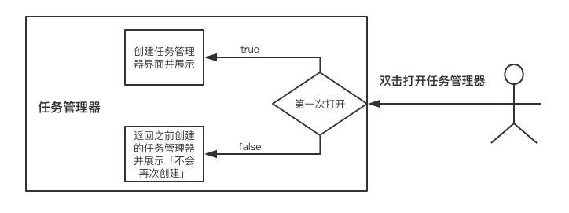

# 单例模式

### 模式动机

在某些系统中，只有一个实例是非常必要的。比如任务管理器，首先从需求上来讲，一个任务管理器窗口完全满足需要。多个任务管理器窗口只会造成**额外的开销**，还需要处理各个窗口数据同步的问题。

### 实现

用一个变量来标记当前的类是否创建过对象，如果没创建过，返回创建之后的实例，如果之前已经创建过，**则返回之前创建过的实例**。



### 通用的单例中间类

我们编写一个生成单例类的通用类

```javascript
// 获取单独的实例
var singleton = function(fn) {
    var instance;
    return function() {
        return instance || (instance = fn.apply(this, arguments));
    }
}

// 创建遮罩层
var createMask = function(){
    // 创建div元素
    var mask = document.createElement('div');
    // 设置样式
    mask.style.position = 'fixed';
    mask.style.top = '0';
    mask.style.right = '0';
    mask.style.bottom = '0';
    mask.style.left = '0';
    mask.style.opacity = 'o.75';
    mask.style.backgroundColor = '#000';
    mask.style.display = 'none';
    mask.style.zIndex = '98';
    document.body.appendChild(mask);
    // 单击隐藏遮罩层
    mask.onclick = function(){
        this.style.display = 'none';
    }
    return mask;
};

// 调用
var oMask = singleton(createMask)()
var eMask = singleton(createMask)()
// 但是 oMask 与 eMask 不相等，获取 eMask 时其实也创建了新的 div
```

这种调用方法其实仅仅是获取到了 `createMask` 中的返回值，每次 `singleton()` 其实都会执行 `var instance` ,所以对 `instance` 的判断其实是没用的。正确调用我觉得应该如下

```javascript
const maskSingleton = singleton(createMask) // 先用一个变量接一下
const oMask = maskSingleton()
const eMask = maskSingleton() // 此时返回的还是之前已经创建的 mask
```

但其实上面的例子并未很好的体现出通用惰性单例模式的作用，而且`oMask` 其实是获取不到 `createMask` 原型链上的方法的「也可能原本作者就不想获取 = =」，但我们之前的举例都是使用构造函数的举例，所以接下来我也会用构造函数的例子来展现。

```javascript
const singleton = function(Fn) {
    var instance
    return function() {
        return instance || (instance = new Fn(...arguments))
    }
}

const Person = function(name){
    this.name = name
}

Person.prototype.getName = function() {
    return this.name
}

const Animal = function(name) {
    this.name = name
}

Animal.prototype.getName = function() {
    return this.name
}

const PersonSingleton = singleton(Person)
const liSi = PersonSingleton('liSi')
const zhangSan = PersonSingleton('zhangSan')

const AnimalSingleton = singleton(Animal)
const cat = AnimalSingleton('cat')
const dog = AnimalSingleton('dog')

console.info(zhangSan.getName()) // 'liSi'
console.info(dog.getName()) // 'cat'
```

